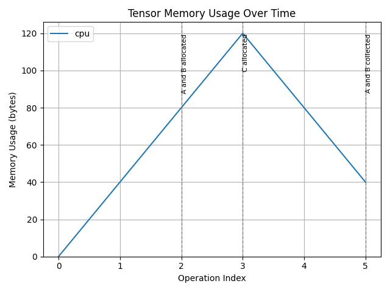

# PyTorch Tensor Profiler (PTTP) #
PyTorch Tensor Profiler (PTTP) is a tool to profile memory allocated by pytorch tensors. PTTP measures the tight bound of tensor memory used by program code, free of any non-eager and superficial abstractions such as the python garbage collector, the pytorch caching allocator, and the linux virtual memory manager.

<p align="center">

</p>

## Support ##
* Tensor allocation and deallocation
* Tensor dunder methods (+, -, *, /, ect.)
* Tensor views which share the same storage
* *As of now, there are no known methods of allocating tensor memory which is not captured by this profiler*

## Usage ##
```python
import gc
import torch
from pttp import TensorProfiler

with TensorProfiler() as prof:
    a = torch.randn(10)
    b = torch.randn(10)
    prof.mark_event("A and B allocated")

    c = a + b
    prof.mark_event("C allocated")
    
    del a, b; gc.collect()
    prof.mark_event("A and B collected")

prof.save_memory_timeline("memory.png")
remaining_memory = prof.memory  # 40 bytes
```

<p align="center">

</p>

## TODO ##
* Add tests for gradients
* Better options for graph visualization
