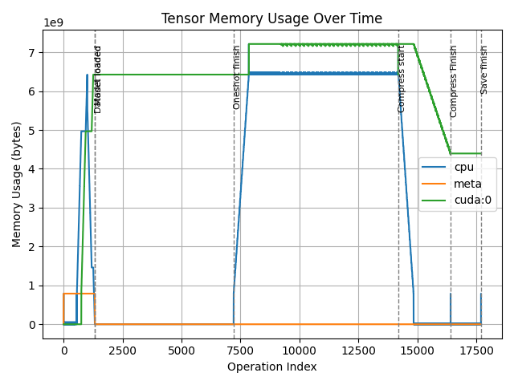
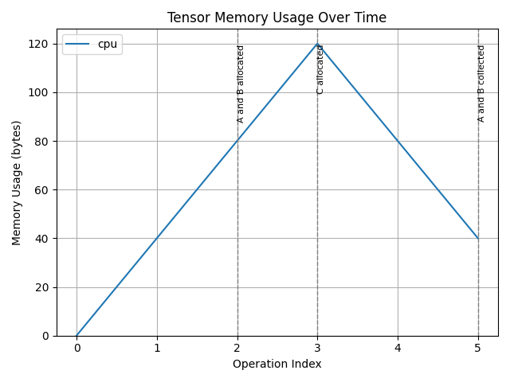

# PyTorch Tensor Profiler (PTTP) #
**PyTorch Tensor Profiler (PTTP)** is a tool for accurately profiling the memory usage of PyTorch tensors. It measures the true memory footprint of tensors created by your program, without interference from higher-level abstractions like the Python garbage collector, PyTorch’s caching allocator, or the Linux virtual memory system.

Unlike torch [memory_viz](https://pytorch.org/blog/understanding-gpu-memory-1/), this PTTP is capable of tracking tensors on all devices (xpu, cpu, meta, etc) and marking milestone events in your program when they occur.

<p align="center">

</p>

## Support ##
* Allocation and deallocation
* Dunder methods (+, -, *, /, ect.)
* Functions with nested outputs (chunk, topk, svd, where, ect.)
* Views which share the same storage
* *As of now, there are no known methods of allocating tensor memory which is not captured by PTTP*

## Usage ##
```python
import gc
import torch
from pttp import TensorProfiler

with TensorProfiler() as prof:
    a = torch.randn(10)
    b = torch.randn(10)
    prof.mark_event("A and B allocated")

    c = a + b
    prof.mark_event("C allocated")
    
    del a, b; gc.collect()
    prof.mark_event("A and B collected")

prof.save_memory_timeline("memory.png")
remaining_memory = prof.memory  # 40 bytes
```

<p align="center">

</p>
