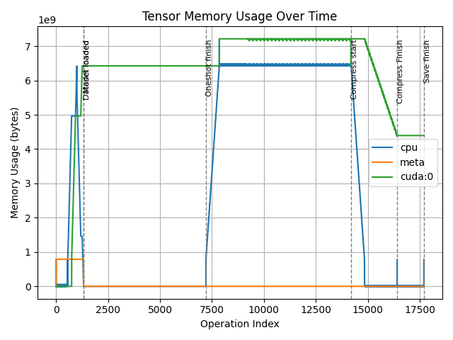

# PyTorch Tensor Profiler (PTTP) #
PyTorch Tensor Profiler (PTTP) is a tool to profile memory allocated by pytorch tensors. This is a work-in-progress project

<p align="center">

</p>

## Support ##
* Tensor allocation and deallocation
* Tensor dunder methods (+, -, *, /, ect.)
* Tensor views which share the same storage
* *As of now, there are no known methods of allocating tensor memory which is not captured by this profiler*

## Usage ##
```python
import gc
import torch
from pttp import TensorProfiler

with TensorProfiler() as prof:
    a = torch.randn(10)
    b = torch.randn(10)
    prof.mark_event("A and B allocated")

    c = a + b
    prof.mark_event("C allocated")
    
    del a, b; gc.collect()
    prof.mark_event("A and B collected")

prof.save_memory_profile("memory.png")
remaining_memory = prof.memory  # 40 bytes
```

<p align="center">

</p>

## Limitations ##
* Need to confirm support for gradients
* Better options and graph visualization cleanup
* Better code documentation
